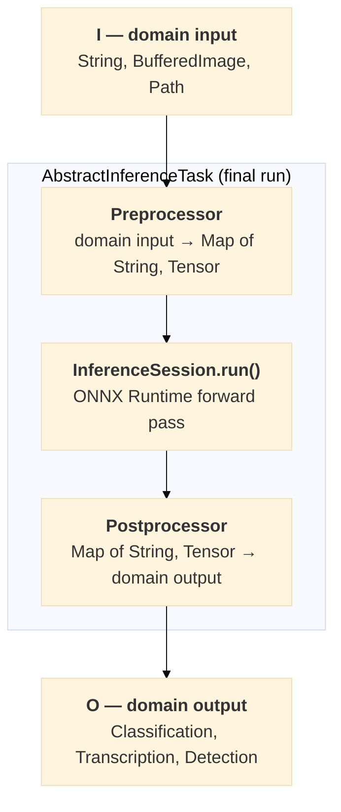
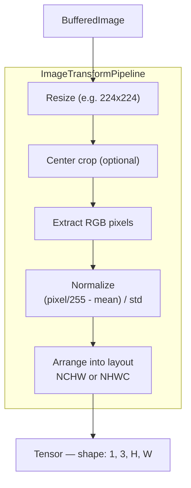

# Adding a Wrapper

This guide explains the internals of inference4j for contributors who want to add support for a new model.

## Architecture overview

Every wrapper follows the same three-stage pattern enforced by `AbstractInferenceTask`:



The `run()` method is `final` — you can't override it. Instead, you provide a `Preprocessor` and a `Postprocessor` to the constructor, and the base class wires the pipeline together.

## Core types

### AbstractInferenceTask

```java
public abstract class AbstractInferenceTask<I, O> implements InferenceTask<I, O> {

    protected final InferenceSession session;
    protected final Preprocessor<I, Map<String, Tensor>> preprocessor;
    protected final Postprocessor<InferenceContext<I>, O> postprocessor;

    protected AbstractInferenceTask(
            InferenceSession session,
            Preprocessor<I, Map<String, Tensor>> preprocessor,
            Postprocessor<InferenceContext<I>, O> postprocessor) {
        // ...
    }

    @Override
    public final O run(I input) {
        Map<String, Tensor> inputs = preprocessor.process(input);
        Map<String, Tensor> outputs = session.run(inputs);
        return postprocessor.process(new InferenceContext<>(input, inputs, outputs));
    }
}
```

Key points:

- `I` is the domain input type (`String`, `BufferedImage`, `Path`)
- `O` is the domain output type (`List<Classification>`, `Transcription`, etc.)
- `run()` is `final` — the pipeline sequence is not negotiable
- You wire preprocessing and postprocessing in your constructor or builder

### InferenceContext

```java
public record InferenceContext<I>(
    I input,
    Map<String, Tensor> preprocessed,
    Map<String, Tensor> outputs
) {}
```

The postprocessor receives the full context — not just the output tensors. This is essential when postprocessing needs information from the original input (e.g., original image dimensions for rescaling bounding boxes back to pixel coordinates).

### Preprocessor and Postprocessor

Both are `@FunctionalInterface`:

```java
@FunctionalInterface
public interface Preprocessor<I, O> {
    O process(I input);
}

@FunctionalInterface
public interface Postprocessor<I, O> {
    O process(I input);
}
```

They support composition via `andThen()` and provide a static `identity()` factory for no-op stages.

## Vision wrappers: ImageTransformPipeline

For image-based models, `ImageTransformPipeline` handles the `BufferedImage → Tensor` conversion. It composes image transforms (resize, center crop, normalize) and produces a correctly shaped float tensor.



### ImageNet preset

For models trained on ImageNet (ResNet, VGG, etc.):

```java
ImageTransformPipeline pipeline = ImageTransformPipeline.imagenet(224);
// mean = [0.485, 0.456, 0.406], std = [0.229, 0.224, 0.225]
// NCHW layout, size 224×224
```

### Custom pipeline

For models with different normalization (EfficientNet, YOLO, etc.), use the builder:

```java
ImageTransformPipeline pipeline = ImageTransformPipeline.builder()
    .resize(280)
    .mean(new float[]{127f/255, 127f/255, 127f/255})
    .std(new float[]{128f/255, 128f/255, 128f/255})
    .layout(ImageLayout.NHWC)
    .build();
```

### Auto-detection from model

The `AbstractImageClassifier.detectPipeline()` helper reads the model's input shape from the ONNX session and auto-configures the pipeline:

- Detects input dimensions → sets resize target
- Detects channel position → sets NCHW or NHWC layout
- Applies the normalization constants you provide

This means adding a new image classifier often requires only specifying the correct mean/std values — the rest is auto-detected.

## Anatomy of a wrapper

Here's the typical structure, using `ResNetClassifier` as a reference:

### 1. Extend the right base class

```java
public class ResNetClassifier extends AbstractImageClassifier {
    // AbstractImageClassifier extends AbstractInferenceTask<BufferedImage, List<Classification>>
    // and implements ImageClassifier (which extends Classifier<BufferedImage, Classification>)
}
```

Choose your base:

| Base class | When to use |
|------------|-------------|
| `AbstractInferenceTask<I, O>` | Any task — most flexible |
| `AbstractImageClassifier` | Image classification (provides `classify()` methods, top-K, label mapping) |
| Direct interface implementation | Stateful models (e.g., `SileroVadDetector` manages hidden state across frames) |

### 2. Define the builder

```java
public static Builder builder() {
    return new Builder();
}

public static class Builder {
    private String modelId = "inference4j/resnet50-v1-7";  // sensible default
    private ModelSource modelSource;
    private SessionConfigurer sessionConfigurer;
    // ... task-specific fields ...

    public Builder modelId(String modelId) { this.modelId = modelId; return this; }
    public Builder modelSource(ModelSource modelSource) { this.modelSource = modelSource; return this; }
    public Builder sessionOptions(SessionConfigurer sc) { this.sessionConfigurer = sc; return this; }

    // package-private — not part of the public API
    Builder session(InferenceSession session) { this.session = session; return this; }

    public ResNetClassifier build() {
        // 1. Resolve model files
        if (session == null) {
            ModelSource source = modelSource != null ? modelSource
                : HuggingFaceModelSource.defaultInstance();
            Path modelDir = source.resolve(modelId);
            session = InferenceSession.of(modelDir.resolve("model.onnx"), sessionConfigurer);
        }
        // 2. Load task-specific resources (labels, vocab, config)
        // 3. Build preprocessor and postprocessor
        // 4. Return new instance
        return new ResNetClassifier(session, preprocessor, labels, ...);
    }
}
```

Key conventions:

- **Default model ID** — every wrapper has a sensible default pointing to the `inference4j` HuggingFace org
- **`.session()` is package-private** — the public API uses `modelId` + `modelSource` + `sessionOptions`
- **Auto-load resources** — labels, vocabulary, config are loaded from the model directory in `build()`

### 3. Wire preprocessing

For vision, the preprocessor converts a `BufferedImage` into a named tensor map:

```java
// In the constructor or builder
Preprocessor<BufferedImage, Map<String, Tensor>> preprocessor =
    image -> Map.of(inputName, imageTransformPipeline.process(image));
```

For NLP, tokenize text into input ID and attention mask tensors:

```java
Preprocessor<String, Map<String, Tensor>> preprocessor = text -> {
    EncodedInput encoded = tokenizer.encode(text, maxLength);
    return Map.of(
        "input_ids", Tensor.of(encoded.inputIds()),
        "attention_mask", Tensor.of(encoded.attentionMask())
    );
};
```

### 4. Wire postprocessing

The postprocessor receives `InferenceContext<I>` — giving access to both the raw output tensors and the original input:

```java
Postprocessor<InferenceContext<BufferedImage>, List<Classification>> postprocessor =
    ctx -> {
        float[] logits = ctx.outputs().get("output").toFloats();
        float[] probs = outputOperator.apply(logits);  // softmax
        int[] topIndices = MathOps.topK(probs, topK);
        return Arrays.stream(topIndices)
            .mapToObj(i -> new Classification(labels.get(i), i, probs[i]))
            .toList();
    };
```

## Utilities available

| Utility | Package | Purpose |
|---------|---------|---------|
| `ImageTransformPipeline` | `io.github.inference4j.image` | BufferedImage → Tensor with resize, normalize, layout |
| `WordPieceTokenizer` | `io.github.inference4j.tokenizer` | Text → token IDs (BERT-family models) |
| `MathOps` | `io.github.inference4j.processing` | `softmax`, `sigmoid`, `topK`, `nms`, `ctcGreedyDecode`, `cxcywh2xyxy` |
| `OutputOperator` | `io.github.inference4j.processing` | Pre-built activations: `softmax()`, `sigmoid()`, `identity()` |
| `Labels` | `io.github.inference4j.image` | Label sets with presets: `Labels.imagenet()`, `Labels.coco()` |
| `AudioLoader` | `io.github.inference4j.audio` | WAV file loading |
| `AudioProcessor` | `io.github.inference4j.audio` | Resample, normalize audio |
| `Vocabulary` | `io.github.inference4j.audio` | Load vocab.json for CTC models |
| `ModelConfig` | `io.github.inference4j.text` | Parse HuggingFace config.json (`id2label`, `problem_type`) |

## Checklist for a new wrapper

1. **Identify the model's contract** — input tensor names, shapes, normalization, output format
2. **Choose a base class** — `AbstractInferenceTask`, `AbstractImageClassifier`, or direct interface implementation
3. **Implement preprocessing** — convert the domain input to the tensors the model expects
4. **Implement postprocessing** — convert output tensors to a meaningful Java result type
5. **Add a builder** with `modelId`, `modelSource`, `sessionOptions`, and task-specific options
6. **Host the ONNX model** under the `inference4j` HuggingFace org with required companion files
7. **Write tests** — unit tests with mocked session, integration tests with the real model
8. **Add Spring Boot auto-configuration** if the wrapper should be available as a managed bean

!!! tip "Sharing your wrapper"
    If you intend to share your wrapper or model with the community, please follow the [Contributing Guide](https://github.com/inference4j/inference4j/blob/main/CONTRIBUTING.md) for instructions on how to submit a pull request and host the model on the [inference4j HuggingFace org](https://huggingface.co/inference4j).
