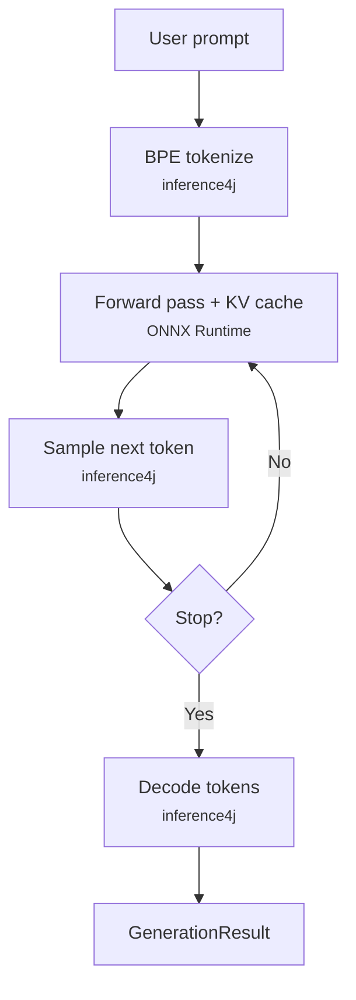

# GPT-2 Text Generation

Generate text with GPT-2 using inference4j's native generation loop — no additional dependencies beyond ONNX Runtime.

GPT-2 is the "hello world" of generative AI in inference4j. It's a small model (124M parameters) that demonstrates the full native generation pipeline: BPE tokenization, KV cache management, token sampling, and streaming — all running in Java on top of standard ONNX Runtime. More model families (Llama, Mistral, Phi via standard ONNX export) will follow this same approach.

## Quick example

```java
try (var gen = Gpt2TextGenerator.builder()
        .maxNewTokens(50)
        .build()) {
    System.out.println(gen.generate("Once upon a time").text());
}
```

## Full example

```java
import io.github.inference4j.generation.GenerationResult;
import io.github.inference4j.nlp.Gpt2TextGenerator;

public class Gpt2TextGeneration {
    public static void main(String[] args) {
        try (var gen = Gpt2TextGenerator.builder()
                .maxNewTokens(100)
                .temperature(0.8f)
                .topK(50)
                .topP(0.9f)
                .build()) {

            GenerationResult result = gen.generate("The meaning of life is");

            System.out.println(result.text());
            System.out.printf("%d tokens in %,d ms%n",
                    result.generatedTokens(), result.duration().toMillis());
        }
    }
}
```

!!! tip "Enable sampling for better output"

    GPT-2 defaults to greedy decoding (`temperature=0`), which produces repetitive
    text. Set `temperature`, `topK`, and `topP` for more coherent output.

## Streaming

Pass a `Consumer<String>` to receive tokens as they are generated:

```java
try (var gen = Gpt2TextGenerator.builder()
        .maxNewTokens(100)
        .temperature(0.8f)
        .topK(50)
        .build()) {
    gen.generate("The quick brown fox", token -> System.out.print(token));
}
```

The final `GenerationResult` is still returned after generation completes, containing
the full text and timing information.

## Builder options

| Method | Type | Default | Description |
|--------|------|---------|-------------|
| `.modelId(String)` | `String` | `"inference4j/gpt2"` | HuggingFace model ID |
| `.modelSource(ModelSource)` | `ModelSource` | `HuggingFaceModelSource` | Model resolution strategy |
| `.sessionOptions(SessionConfigurer)` | `SessionConfigurer` | — | ONNX Runtime session options (e.g., thread count) |
| `.chatTemplate(ChatTemplate)` | `ChatTemplate` | — | Optional prompt formatting |
| `.maxNewTokens(int)` | `int` | `256` | Maximum number of tokens to generate |
| `.temperature(float)` | `float` | `0.0` | Sampling temperature (higher = more random) |
| `.topK(int)` | `int` | `0` (disabled) | Top-K sampling (keep K most probable tokens) |
| `.topP(float)` | `float` | `0.0` (disabled) | Nucleus sampling (keep tokens summing to P probability) |
| `.eosTokenId(int)` | `int` | Auto-detected | End-of-sequence token ID (loaded from `config.json`) |
| `.stopSequence(String)` | `String` | — | Stop sequence (can be called multiple times) |

## Result type

`GenerationResult` is a record with:

| Field | Type | Description |
|-------|------|-------------|
| `text()` | `String` | The generated text |
| `promptTokens()` | `int` | Number of tokens in the input prompt |
| `generatedTokens()` | `int` | Number of tokens generated |
| `duration()` | `Duration` | Wall-clock generation time |

## How it works

`Gpt2TextGenerator` uses inference4j's native generation engine. The entire autoregressive loop — tokenization, KV cache management, sampling, and decoding — runs in Java, with only the forward passes delegated to ONNX Runtime.



See the [introduction](introduction.md) for a detailed explanation of the autoregressive loop, KV cache, and how native generation compares to onnxruntime-genai.

## What to expect from GPT-2

GPT-2 is a 2019 model with 124 million parameters. It's useful for demonstrating generation mechanics but it's not a powerful language model by modern standards:

- **Output quality** — coherent sentences but not meaningful reasoning. This is expected.
- **No instruction following** — GPT-2 is a base model (not instruction-tuned), so it completes text rather than following instructions.
- **Speed** — fast inference due to its small size (~500 MB). Typical throughput on CPU is 10-30 tokens/second.

As inference4j adds support for larger model families (Llama, Mistral, Phi via standard ONNX export), the same native generation pipeline will power those models with significantly better output quality.

## Tips

- Use `temperature(0.8f)`, `topK(50)`, `topP(0.9f)` to avoid degenerate repetition from greedy decoding.
- Lower `maxNewTokens` for demos or quick tests — it directly controls how many forward passes run.
- Reuse `Gpt2TextGenerator` instances across prompts — each one holds the model and tokenizer in memory.
- The model downloads ~500 MB on first use and is cached in `~/.cache/inference4j/`.
