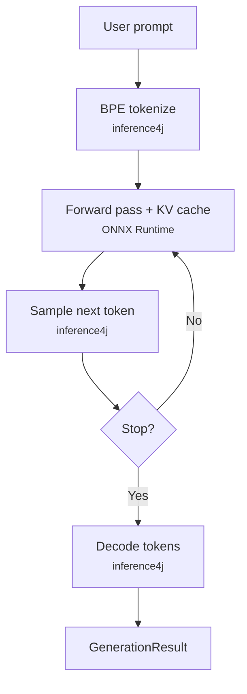

# Native Text Generation

Generate text with GPT-2, SmolLM2, Qwen2.5, and other models using inference4j's native generation loop — no additional dependencies beyond ONNX Runtime.

`OnnxTextGenerator` is the single entry point for all natively-supported text generation models. Named presets provide one-liner access to popular models, and the generic builder supports custom models.

## Quick example

```java
// GPT-2 — completion model
try (var gen = OnnxTextGenerator.gpt2().maxNewTokens(50).build()) {
    System.out.println(gen.generate("Once upon a time").text());
}

// SmolLM2-360M — ChatML instruct model
try (var gen = OnnxTextGenerator.smolLM2().maxNewTokens(50).build()) {
    System.out.println(gen.generate("What is the capital of France?").text());
}

// Qwen2.5-1.5B — ChatML instruct model
try (var gen = OnnxTextGenerator.qwen2().maxNewTokens(100).build()) {
    System.out.println(gen.generate("Explain gravity").text());
}
```

## Full example

```java
import io.github.inference4j.generation.GenerationResult;
import io.github.inference4j.nlp.OnnxTextGenerator;

public class TextGeneration {
    public static void main(String[] args) {
        try (var gen = OnnxTextGenerator.qwen2()
                .maxNewTokens(100)
                .temperature(0.8f)
                .topK(50)
                .topP(0.9f)
                .build()) {

            GenerationResult result = gen.generate("The meaning of life is");

            System.out.println(result.text());
            System.out.printf("%d tokens in %,d ms%n",
                    result.generatedTokens(), result.duration().toMillis());
        }
    }
}
```

!!! tip "Enable sampling for better output"

    GPT-2 defaults to greedy decoding (`temperature=0`), which produces repetitive
    text. Set `temperature`, `topK`, and `topP` for more coherent output.
    Instruct models (SmolLM2, Qwen2.5) also benefit from sampling.

## Streaming

Pass a `Consumer<String>` to receive tokens as they are generated:

```java
try (var gen = OnnxTextGenerator.smolLM2()
        .maxNewTokens(100)
        .temperature(0.8f)
        .topK(50)
        .build()) {
    gen.generate("Tell me a joke", token -> System.out.print(token));
}
```

The final `GenerationResult` is still returned after generation completes, containing
the full text and timing information.

## Model presets

| Preset | Model | Parameters | Size | Chat Template |
|--------|-------|-----------|------|---------------|
| `OnnxTextGenerator.gpt2()` | GPT-2 | 124M | ~500 MB | None (completion) |
| `OnnxTextGenerator.smolLM2()` | SmolLM2-360M-Instruct | 360M | ~700 MB | ChatML |
| `OnnxTextGenerator.qwen2()` | Qwen2.5-1.5B-Instruct | 1.5B | ~3 GB | ChatML |

## Builder options

| Method | Type | Default | Description |
|--------|------|---------|-------------|
| `.modelId(String)` | `String` | Preset-dependent | HuggingFace model ID |
| `.modelSource(ModelSource)` | `ModelSource` | `HuggingFaceModelSource` | Model resolution strategy |
| `.sessionOptions(SessionConfigurer)` | `SessionConfigurer` | — | ONNX Runtime session options (e.g., thread count) |
| `.chatTemplate(ChatTemplate)` | `ChatTemplate` | Preset-dependent | Prompt formatting |
| `.addedToken(String)` | `String` | Preset-dependent | Register a special token for atomic encoding |
| `.tokenizerPattern(Pattern)` | `Pattern` | GPT-2 pattern | Pre-tokenization regex |
| `.maxNewTokens(int)` | `int` | `256` | Maximum number of tokens to generate |
| `.temperature(float)` | `float` | `0.0` | Sampling temperature (higher = more random) |
| `.topK(int)` | `int` | `0` (disabled) | Top-K sampling (keep K most probable tokens) |
| `.topP(float)` | `float` | `0.0` (disabled) | Nucleus sampling (keep tokens summing to P probability) |
| `.eosTokenId(int)` | `int` | Auto-detected | End-of-sequence token ID (loaded from `config.json`) |
| `.stopSequence(String)` | `String` | — | Stop sequence (can be called multiple times) |

## Result type

`GenerationResult` is a record with:

| Field | Type | Description |
|-------|------|-------------|
| `text()` | `String` | The generated text |
| `promptTokens()` | `int` | Number of tokens in the input prompt |
| `generatedTokens()` | `int` | Number of tokens generated |
| `duration()` | `Duration` | Wall-clock generation time |

## How it works

`OnnxTextGenerator` uses inference4j's native generation engine. The entire autoregressive loop — tokenization, KV cache management, sampling, and decoding — runs in Java, with only the forward passes delegated to ONNX Runtime.



See the [introduction](introduction.md) for a detailed explanation of the autoregressive loop, KV cache, and how native generation compares to onnxruntime-genai.

## Custom models

Use `OnnxTextGenerator.builder()` for any BPE-based causal LM exported to ONNX with KV cache:

```java
try (var gen = OnnxTextGenerator.builder()
        .modelId("my-org/my-model")
        .addedToken("<|special_start|>")
        .addedToken("<|special_end|>")
        .chatTemplate(msg -> "<|user|>" + msg + "<|assistant|>")
        .temperature(0.7f)
        .maxNewTokens(100)
        .build()) {
    gen.generate("Hello", token -> System.out.print(token));
}
```

The model directory must contain `model.onnx`, `vocab.json`, `merges.txt`, and `config.json`.

## Tips

- Use `temperature(0.8f)`, `topK(50)`, `topP(0.9f)` to avoid degenerate repetition from greedy decoding.
- Lower `maxNewTokens` for demos or quick tests — it directly controls how many forward passes run.
- Reuse `OnnxTextGenerator` instances across prompts — each one holds the model and tokenizer in memory.
- Models download on first use and are cached in `~/.cache/inference4j/`.
