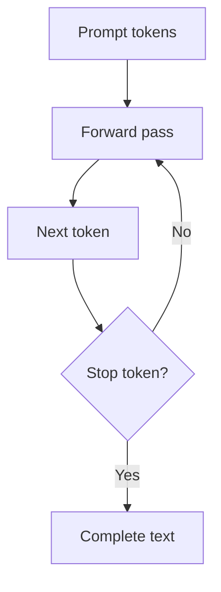
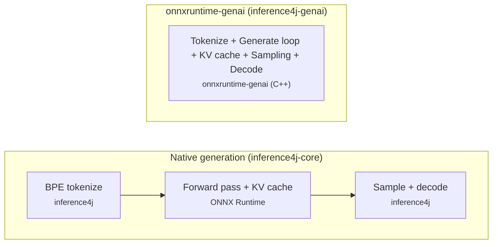

# Generative AI

Run autoregressive models — text generation, speech-to-text, and vision-language — directly in Java with token-by-token generation and streaming.

## Two approaches to generation

All models in inference4j outside this section are **single-pass** — one forward pass, one result. Generative models are fundamentally different. They produce output **one token at a time** in a loop, feeding each token back into the model to produce the next one. This loop requires managing a KV cache, token sampling, and stop conditions.

inference4j supports two approaches to running this loop:

### Native generation (inference4j-core)

inference4j implements the full autoregressive loop in Java on top of standard ONNX Runtime. This includes KV cache management, token sampling (temperature, top-K, top-P), BPE tokenization with decoding, and streaming — all built into `inference4j-core` with zero additional dependencies.

**Pros:**

- Works with any ONNX model that exports KV cache inputs/outputs — the standard HuggingFace ONNX export format
- No extra native libraries beyond ONNX Runtime
- Full control over the generation pipeline (sampling, stop sequences, token streaming)

**Cons:**

- The generation loop runs in Java rather than optimized C++, so it's slightly slower per token
- Currently supports GPT-2, SmolLM2, and Qwen2.5; more model families will follow

### onnxruntime-genai (inference4j-genai)

[onnxruntime-genai](https://github.com/microsoft/onnxruntime-genai) is a native library by Microsoft that handles the entire generation pipeline in optimized C++ — tokenization, the generation loop, KV cache, and sampling. inference4j wraps this library via the `inference4j-genai` module.

**Pros:**

- The entire loop (including tokenization and KV cache) runs in native C++, maximizing throughput
- Supports multimodal models (Phi-3.5 Vision) where image preprocessing is handled natively

**Cons:**

- Models must be exported in onnxruntime-genai's specific format — few are available today
- The library is in preview and community support is limited; Microsoft's investment appears to have slowed
- Requires a separate native dependency (`onnxruntime-genai`) that we build and publish ourselves since Microsoft does not currently publish Java bindings to Maven Central
- GPU support is not available in the Java bindings

!!! warning "onnxruntime-genai is experimental"

    The `inference4j-genai` module wraps a library in preview. We maintain the
    [onnxruntime-genai Java build](https://github.com/inference4j/onnxruntime-genai)
    ourselves. The API may change between releases.

### Where we're heading

The native generation approach is the future. It unlocks any ONNX model on HuggingFace that exports with KV cache support — hundreds of models — without depending on a third-party native library. `OnnxTextGenerator` already supports GPT-2, SmolLM2-360M, and Qwen2.5-1.5B, with more model families to follow.

The onnxruntime-genai path remains valuable for models that need native multimodal preprocessing (like Phi-3.5 Vision) and for users who prefer the optimized C++ loop.

## The autoregressive loop

A generative model doesn't produce its entire output in a single forward pass.
It produces **one token at a time**. Each token is fed back into the model to produce
the next one, forming a loop that continues until the model emits a stop token or
reaches a maximum length.

If you ask a model "What is Java?" and it generates a 50-token answer, the model runs
50 forward passes — one for each token in the response. This is why generation is
orders of magnitude slower than classification or embedding.

### The KV cache

There's a problem with the naive loop above. Each forward pass computes **attention**
over all previous tokens. Without optimization, generating token 50 would recompute
attention over all 49 previous tokens from scratch — the same work done for tokens
1 through 49, repeated entirely.

The **KV cache** (key-value cache) solves this. During each forward pass, the model
caches the intermediate key and value tensors from the attention layers. On the next
pass, only the new token's attention needs to be computed — everything from previous
tokens is read from the cache. This turns generation from O(n^2^) to O(n) in
sequence length.

### How the two approaches differ

In native generation, inference4j handles tokenization, sampling, and decoding in Java while ONNX Runtime does the forward passes. In the genai path, the entire pipeline runs in onnxruntime-genai's native C++ layer.

## Supported models

### Native generation (inference4j-core)

| Model | Preset | Model ID | Parameters | Size |
|-------|--------|----------|-----------|------|
| GPT-2 | `OnnxTextGenerator.gpt2()` | `inference4j/gpt2` | 124M | ~500 MB |
| SmolLM2-360M-Instruct | `OnnxTextGenerator.smolLM2()` | `inference4j/smollm2-360m-instruct` | 360M | ~700 MB |
| Qwen2.5-1.5B-Instruct | `OnnxTextGenerator.qwen2()` | `inference4j/qwen2.5-1.5b-instruct` | 1.5B | ~3 GB |

### onnxruntime-genai (inference4j-genai)

| Model | Wrapper | Model ID | Parameters | Size |
|-------|---------|----------|-----------|------|
| Phi-3 Mini 4K Instruct | `TextGenerator` | `inference4j/phi-3-mini-4k-instruct` | 3.8B | ~2.7 GB |
| DeepSeek-R1-Distill-Qwen-1.5B | `TextGenerator` | `inference4j/deepseek-r1-distill-qwen-1.5b` | 1.5B | ~1 GB |
| Whisper Small | `WhisperSpeechModel` | `inference4j/whisper-small-genai` | — | ~500 MB |
| Phi-3.5 Vision Instruct | `VisionLanguageModel` | `inference4j/phi-3.5-vision-instruct` | 4.2B | ~3.3 GB |

All models are hosted on the
[inference4j HuggingFace org](https://huggingface.co/inference4j)
and downloaded automatically on first use.

## Next steps

- [Native Text Generation](gpt2.md) — GPT-2, SmolLM2, Qwen2.5 via OnnxTextGenerator (no extra dependencies)
- [Chat Templates](chat-templates.md) — how prompt formatting works across models
- [Text Generation (onnxruntime-genai)](text-generation.md) — Phi-3, DeepSeek-R1 via onnxruntime-genai
- [Whisper Speech-to-Text](whisper.md) — transcription and translation via onnxruntime-genai
- [Phi-3.5 Vision](phi-vision.md) — image description and visual Q&A via onnxruntime-genai
