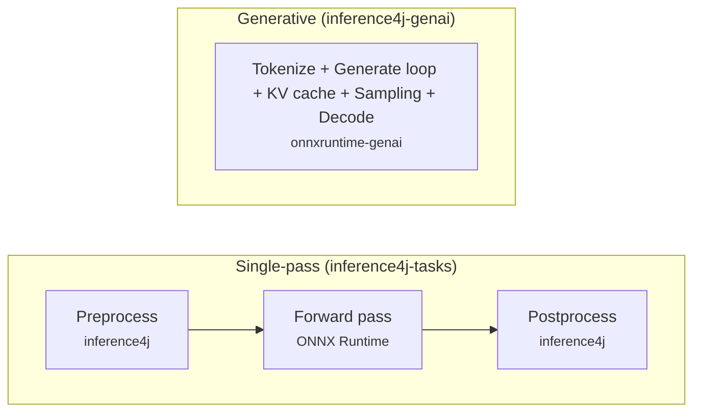

# Generative AI

Run autoregressive models — text generation (Phi-3, DeepSeek-R1), speech-to-text (Whisper), and vision-language (Phi-3.5 Vision) — directly in Java with token-by-token generation and streaming.

!!! warning "Experimental"

    The generative AI module (`inference4j-genai`) is experimental. We maintain the
    [onnxruntime-genai](https://github.com/microsoft/onnxruntime-genai) build ourselves
    for the time being — it is not yet published to Maven Central by Microsoft.
    GPU support is not available. The API may change between releases.

## Our approach and model availability

Generative models (text generation, speech-to-text) work differently from single-pass
models (classifiers, detectors, embeddings). They produce output **one token at a time**
in a loop that requires managing a memory cache, token sampling, and stop conditions.
Libraries like HuggingFace Transformers implement this loop themselves on top of standard
ONNX files, giving them access to hundreds of models on HuggingFace.

For this first release, we chose a different path: delegate the generation loop to
[onnxruntime-genai](https://github.com/microsoft/onnxruntime-genai), a native library
by Microsoft that handles the entire pipeline in optimized C++. This lets us ship
generative AI support with the same three-line experience as the rest of inference4j,
enabling early experimentation and feedback without waiting for a full loop implementation.

The trade-off is model availability. onnxruntime-genai requires models in its own format,
and few are published this way today. That's why the supported model list is short — not
a limitation of inference4j, but of the export ecosystem.

**Your code is insulated from this.** The API you write against — `TextGenerator`,
`WhisperSpeechModel`, `VisionLanguageModel`, their builders and result types — is stable regardless of what
runs underneath. Adding a native generation loop later would be a provider switch on
the builder, unlocking the full HuggingFace catalog without changing your application code.

## Quick example

```java
try (var generator = TextGenerator.builder()
        .model(ModelSources.phi3Mini())
        .build()) {
    generator.generate("Explain recursion.", token -> System.out.print(token));
}
```

## Single-pass vs autoregressive

The rest of inference4j — image classification, speech-to-text, object detection — uses
**single-pass inference**. You feed an input through the model once and get an output.
A classifier runs one forward pass to produce logits. A speech recognizer runs one forward
pass to produce per-frame character probabilities. The pipeline is always the same:

```
Input → Preprocess → One forward pass → Postprocess → Output
```

Text generation is fundamentally different.

### The autoregressive loop

A generative model doesn't produce its entire output in a single forward pass.
It produces **one token at a time**. Each token is fed back into the model to produce
the next one, forming a loop that continues until the model emits a stop token or
reaches a maximum length.


If you ask a model "What is Java?" and it generates a 50-token answer, the model runs
50 forward passes — one for each token in the response. This is why generation is
orders of magnitude slower than classification or embedding.

### The KV cache

There's a problem with the naive loop above. Each forward pass computes **attention**
over all previous tokens. Without optimization, generating token 50 would recompute
attention over all 49 previous tokens from scratch — the same work done for tokens
1 through 49, repeated entirely.

The **KV cache** (key-value cache) solves this. During each forward pass, the model
caches the intermediate key and value tensors from the attention layers. On the next
pass, only the new token's attention needs to be computed — everything from previous
tokens is read from the cache. This turns generation from O(n^2^) to O(n) in
sequence length.

Managing the KV cache correctly — allocating memory, appending new entries, handling
batch dimensions — is fiddly and error-prone to do by hand.

### Why onnxruntime-genai

In the single-pass world, inference4j controls the full pipeline. We handle
preprocessing (tokenization, image resizing, audio resampling), call ONNX Runtime
for one forward pass, and handle postprocessing (softmax, CTC decode, NMS).
We own every stage.

Generative models don't fit this pattern. The generation loop, KV cache management,
token sampling (temperature, top-k, top-p), and even tokenization are all deeply
intertwined. Extracting any one stage breaks the others.

[onnxruntime-genai](https://github.com/microsoft/onnxruntime-genai) is Microsoft's
dedicated library for exactly this. It takes over the entire pipeline — tokenization,
the generation loop, KV cache, sampling — and exposes a single high-level API.
inference4j wraps this library to give you the same ergonomic builder pattern
you're used to, while onnxruntime-genai handles the heavy lifting underneath.



In single-pass inference, inference4j does the pre/post work and ONNX Runtime does one
forward pass. In generative inference, onnxruntime-genai owns everything — inference4j
provides the builder API, model resolution, and streaming interface on top.

## Model configuration and chat templates

Single-pass wrappers like `ResNetClassifier` or `Wav2Vec2Recognizer` only need a
`ModelSource` to locate their `.onnx` file — inference4j handles the rest. Generative
models are more demanding. They require multiple files (ONNX weights, tokenizer
vocabulary, generation config, special token maps), and each model family uses a
different **chat template** to format prompts.

For example, Phi-3 wraps user messages with `<|user|>` and `<|end|>` markers, while
DeepSeek-R1 uses `<|User|>` and `<|Assistant|>` markers with different Unicode
characters. Sending a prompt in the wrong format produces garbage output.

This is why the builder uses `.model(GenerativeModel)` instead of the `.modelId(String)`
pattern used by single-pass wrappers. A `GenerativeModel` bundles everything the
generator needs: the `ModelSource` (which files to download) and the `ChatTemplate`
(how to format prompts). The `ModelSources` factory provides preconfigured instances
for each supported model:

```java
// Everything is preconfigured — model files, chat template, special tokens
TextGenerator.builder()
        .model(ModelSources.phi3Mini())
        .build();

// For custom models, provide both pieces explicitly
TextGenerator.builder()
        .modelSource(myCustomSource)
        .chatTemplate(msg -> "<|user|>\n" + msg + "<|end|>\n<|assistant|>\n")
        .build();
```

## Supported models

### Text generation

| Model | Model ID | Parameters | Size | License |
|-------|----------|-----------|------|---------|
| Phi-3 Mini 4K Instruct | `inference4j/phi-3-mini-4k-instruct` | 3.8B | ~2.7 GB | MIT |
| DeepSeek-R1-Distill-Qwen-1.5B | `inference4j/deepseek-r1-distill-qwen-1.5b` | 1.5B | ~1 GB | MIT |

### Speech-to-text

| Model | Model ID | Size | License |
|-------|----------|------|---------|
| Whisper Small | `inference4j/whisper-small-genai` | ~500 MB | MIT |

### Vision-language

| Model | Model ID | Parameters | Size | License |
|-------|----------|-----------|------|---------|
| Phi-3.5 Vision Instruct | `inference4j/phi-3.5-vision-instruct` | 4.2B | ~3.3 GB | MIT |

All models are hosted on the
[inference4j HuggingFace org](https://huggingface.co/inference4j)
and downloaded automatically on first use.

## Next steps

- [Text Generation](text-generation.md) — builder options, streaming, and usage details
- [Whisper Speech-to-Text](whisper.md) — transcription, translation, and auto-chunking
- [Phi-3.5 Vision](phi-vision.md) — image description, visual Q&A, and streaming
