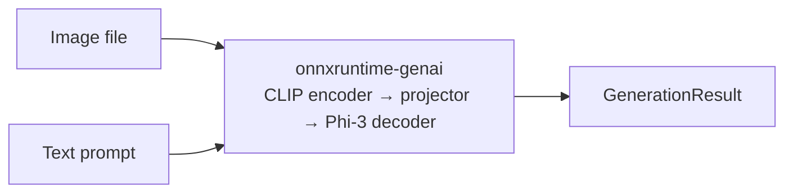

# Phi-3.5 Vision

Ask questions about images and get text answers using Microsoft's Phi-3.5 Vision model.

See the [overview](introduction.md) for background on how autoregressive generation
differs from single-pass inference.

## Quick example

```java
try (var vision = VisionLanguageModel.builder()
        .model(ModelSources.phi3Vision())
        .build()) {
    GenerationResult result = vision.generate(
            new VisionInput(Path.of("cat.jpg"), "Describe this image."));
    System.out.println(result.text());
}
```

```
The image shows a close-up of an orange tabby cat with a white collar.
The cat's eyes are green, and it has a neutral expression. The background
is blurred, with hints of a red object and a green plant.
```

## Full example

```java
import io.github.inference4j.generation.GenerationResult;
import io.github.inference4j.genai.ModelSources;
import io.github.inference4j.vision.VisionInput;
import io.github.inference4j.vision.VisionLanguageModel;
import java.nio.file.Path;

public class ImageDescription {
    public static void main(String[] args) {
        Path image = Path.of("cat.jpg");

        try (var vision = VisionLanguageModel.builder()
                .model(ModelSources.phi3Vision())
                .build()) {

            // Describe an image
            GenerationResult description = vision.generate(
                    new VisionInput(image, "Describe this image."));
            System.out.println(description.text());

            // Ask a question about it
            GenerationResult answer = vision.generate(
                    new VisionInput(image, "What colors are prominent in this image?"));
            System.out.println(answer.text());
        }
    }
}
```

<figure markdown="span">
  
  <figcaption>Screenshot from showcase app</figcaption>
</figure>

## Streaming

Pass a `Consumer<String>` to receive tokens as they are generated:

```java
try (var vision = VisionLanguageModel.builder()
        .model(ModelSources.phi3Vision())
        .build()) {
    vision.generate(
            new VisionInput(Path.of("cat.jpg"), "Describe this image."),
            token -> System.out.print(token));
}
```

## Builder options

| Method | Type | Default | Description |
|--------|------|---------|-------------|
| `.model(GenerativeModel)` | `GenerativeModel` | — | Preconfigured model from `ModelSources` |
| `.modelId(String)` | `String` | — | HuggingFace model ID (requires `.chatTemplate()`) |
| `.modelSource(ModelSource)` | `ModelSource` | `HuggingFaceModelSource` | Model resolution strategy |
| `.chatTemplate(ChatTemplate)` | `ChatTemplate` | — | Prompt formatting (must include `<\|image_1\|>` placeholder) |
| `.maxLength(int)` | `int` | `4096` | Maximum total sequence length (input image tokens + output tokens) |
| `.temperature(double)` | `double` | `0.0` | Sampling temperature (0 = greedy) |
| `.topK(int)` | `int` | `0` (disabled) | Top-K sampling |
| `.topP(double)` | `double` | `0.0` (disabled) | Nucleus sampling |

## Methods

| Method | Description |
|--------|-------------|
| `generate(VisionInput)` | Generate text from an image and prompt |
| `generate(VisionInput, Consumer)` | Generate with token streaming |

## How it works

Phi-3.5 Vision is a **decoder-only** vision-language model. Unlike Whisper (encoder-decoder),
it interleaves image tokens with text tokens in a single sequence:

1. The image goes through a CLIP ViT encoder to produce visual embeddings
2. An MLP projector maps visual embeddings into the language model's token space
3. The Phi-3 Mini decoder processes interleaved image + text tokens autoregressively



All heavy lifting — image preprocessing, vision encoding, embedding projection,
autoregressive decoding, KV cache — is handled natively by onnxruntime-genai.

## Custom models

For a custom vision-language model, provide a model source and chat template:

```java
try (var vision = VisionLanguageModel.builder()
        .modelId("my-org/my-vision-model")
        .chatTemplate(msg ->
                "<|user|>\n<|image_1|>\n" + msg + "\n<|end|>\n<|assistant|>\n")
        .build()) {
    vision.generate(new VisionInput(Path.of("photo.jpg"), "Describe this image."));
}
```

The chat template must include `<|image_1|>` where the image embeddings should be
inserted. The `MultiModalProcessor` handles the substitution internally.

## Tips

- `temperature(0.0)` (default) gives deterministic, greedy decoding — best for factual descriptions.
- Use higher `maxLength` for detailed descriptions and lower values for short answers.
- The model downloads ~3.3 GB on first use (INT4 quantized).
- Reuse `VisionLanguageModel` instances — each one holds three ONNX models in memory (vision encoder, embedding projector, text decoder).
