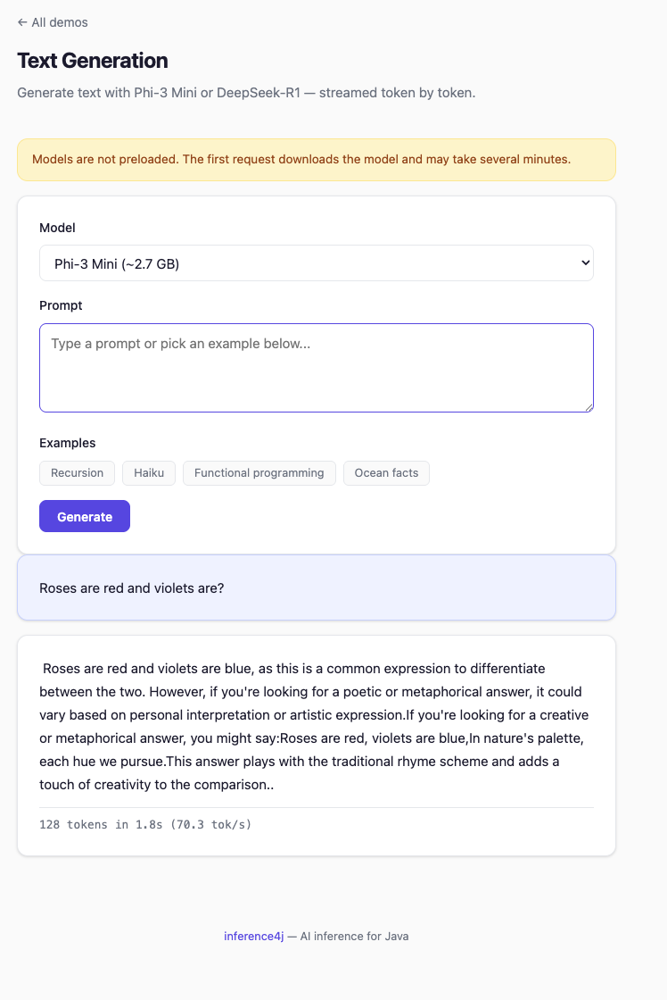
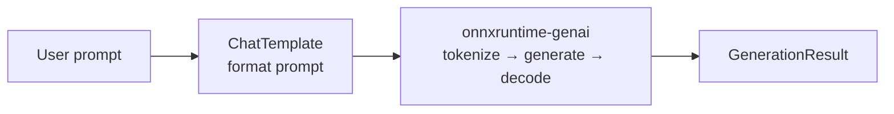

# Text Generation

Generate text with decoder-only language models like Phi-3 and DeepSeek-R1, with built-in streaming support.

See the [overview](introduction.md) for background on how autoregressive generation differs from single-pass inference.

## Quick example

```java
try (var generator = TextGenerator.builder()
        .model(ModelSources.phi3Mini())
        .build()) {
    System.out.println(generator.generate("What is Java?").text());
}
```

## Full example

```java
import io.github.inference4j.genai.GenerationResult;
import io.github.inference4j.genai.ModelSources;
import io.github.inference4j.nlp.TextGenerator;

public class TextGeneration {
    public static void main(String[] args) {
        try (var generator = TextGenerator.builder()
                .model(ModelSources.phi3Mini())
                .maxLength(200)
                .temperature(0.7)
                .build()) {

            GenerationResult result = generator.generate("What is Java in one sentence?");

            System.out.println(result.text());
            System.out.printf("%d tokens in %,d ms%n",
                    result.tokenCount(), result.durationMillis());
        }
    }
}
```

<figure markdown="span">
  
  <figcaption>Screenshot from showcase app</figcaption>
</figure>

## Streaming

Pass a `Consumer<String>` to receive tokens as they are generated:

```java
try (var generator = TextGenerator.builder()
        .model(ModelSources.deepSeekR1_1_5B())
        .maxLength(200)
        .build()) {
    generator.generate("Explain recursion in simple terms.", token -> System.out.print(token));
}
```

The final `GenerationResult` is still returned after generation completes, containing
the full text and timing information.

## Builder options

| Method | Type | Default | Description |
|--------|------|---------|-------------|
| `.model(GenerativeModel)` | `GenerativeModel` | — | Preconfigured model from `ModelSources` |
| `.modelSource(ModelSource)` | `ModelSource` | — | Custom model source (requires `.chatTemplate()`) |
| `.chatTemplate(ChatTemplate)` | `ChatTemplate` | — | Prompt formatting for custom models |
| `.maxLength(int)` | `int` | `1024` | Maximum number of tokens to generate |
| `.temperature(double)` | `double` | `1.0` | Sampling temperature (higher = more random) |
| `.topK(int)` | `int` | `0` (disabled) | Top-K sampling (keep K most probable tokens) |
| `.topP(double)` | `double` | `0.0` (disabled) | Nucleus sampling (keep tokens summing to P probability) |

## Result type

`GenerationResult` is a record with three fields:

| Field | Type | Description |
|-------|------|-------------|
| `text()` | `String` | The generated text |
| `tokenCount()` | `int` | Number of tokens generated |
| `durationMillis()` | `long` | Wall-clock generation time in milliseconds |

## How it works

`TextGenerator` formats the prompt using the model's chat template, then delegates to
onnxruntime-genai for tokenization, the autoregressive generation loop, and decoding.



See the [overview](introduction.md) for a detailed explanation of the
generation loop, KV cache, and why this architecture differs from single-pass wrappers.

## Tips

- Generation speed scales with model size. DeepSeek-R1 (1.5B) is noticeably faster
  than Phi-3 (3.8B) on the same hardware.
- Lower `maxLength` for short answers — it bounds the generation loop.
- `temperature` below 1.0 gives more focused output; above 1.0 gives more varied output.
- Reuse `TextGenerator` instances across prompts — each one holds the model in memory.
