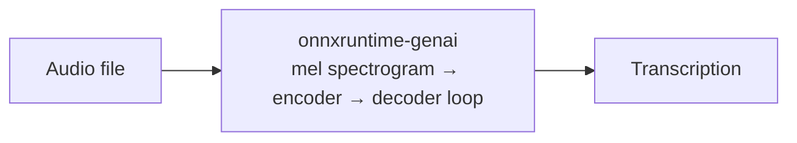

# Whisper Speech-to-Text

!!! warning "Work in Progress"

    `WhisperSpeechModel` is implemented but the pre-exported model artifact
    (`inference4j/whisper-small-genai`) is not yet available on HuggingFace.
    The onnxruntime Whisper converter has compatibility issues with current
    Python package versions. This page documents the target API.

Transcribe and translate speech using OpenAI's Whisper models, with automatic chunking for long audio.

See the [overview](index.md) for background on how autoregressive generation differs from single-pass inference.

## Quick example

```java
try (var whisper = WhisperSpeechModel.builder()
        .modelId("inference4j/whisper-small-genai")
        .build()) {
    System.out.println(whisper.transcribe(Path.of("meeting.wav")).text());
}
```

## Full example

```java
import io.github.inference4j.audio.WhisperSpeechModel;
import io.github.inference4j.audio.Transcription;
import java.nio.file.Path;

public class WhisperTranscription {
    public static void main(String[] args) {
        try (var whisper = WhisperSpeechModel.builder()
                .modelId("inference4j/whisper-small-genai")
                .build()) {

            Transcription result = whisper.transcribe(Path.of("meeting.wav"));
            System.out.println(result.text());
        }
    }
}
```

## Translation

Whisper can translate speech from any supported language into English:

```java
try (var whisper = WhisperSpeechModel.builder()
        .modelId("inference4j/whisper-small-genai")
        .language("fr")
        .task(WhisperTask.TRANSLATE)
        .build()) {
    Transcription result = whisper.transcribe(Path.of("french-audio.wav"));
    System.out.println(result.text());  // English translation
}
```

## From raw audio data

If you already have audio samples as a float array:

```java
try (var whisper = WhisperSpeechModel.builder()
        .modelId("inference4j/whisper-small-genai")
        .build()) {
    float[] samples = loadAudioSamples();
    Transcription result = whisper.transcribe(samples, 16000);
    System.out.println(result.text());
}
```

## Builder options

| Method | Type | Default | Description |
|--------|------|---------|-------------|
| `.modelId(String)` | `String` | — | HuggingFace model ID (required) |
| `.modelSource(ModelSource)` | `ModelSource` | `HuggingFaceModelSource` | Model resolution strategy |
| `.language(String)` | `String` | `"en"` | Source language code (e.g., `"fr"`, `"de"`, `"ja"`) |
| `.task(WhisperTask)` | `WhisperTask` | `TRANSCRIBE` | `TRANSCRIBE` or `TRANSLATE` (to English) |
| `.maxLength(int)` | `int` | `448` | Maximum number of tokens to generate per chunk |
| `.temperature(double)` | `double` | `0.0` | Sampling temperature (0 = greedy) |
| `.topK(int)` | `int` | `0` (disabled) | Top-K sampling |
| `.topP(double)` | `double` | `0.0` (disabled) | Nucleus sampling |

## Result type

`Transcription` is a record with:

| Field | Type | Description |
|-------|------|-------------|
| `text()` | `String` | The transcribed or translated text |
| `segments()` | `List<Segment>` | Timed segments (when available) |

Each `Segment` contains:

| Field | Type | Description |
|-------|------|-------------|
| `text()` | `String` | Segment text |
| `startTime()` | `float` | Start time in seconds |
| `endTime()` | `float` | End time in seconds |

## Auto-chunking

Whisper processes audio in 30-second windows. For audio longer than 30 seconds,
`WhisperSpeechModel` automatically:

1. Splits the audio into 30-second chunks
2. Transcribes each chunk independently
3. Concatenates the results

This happens transparently — just call `transcribe()` with any length audio.

## How it works

Unlike [Wav2Vec2](../use-cases/speech-to-text.md) (single-pass CTC), Whisper is an
**autoregressive** encoder-decoder model. The audio is encoded into a mel spectrogram,
then the decoder generates text tokens one at a time.



All heavy lifting — mel spectrogram computation, encoder forward pass, autoregressive
decoding, KV cache, beam search — is handled natively by onnxruntime-genai's C++ layer.

## Whisper vs Wav2Vec2

| | Wav2Vec2 | Whisper |
|---|---------|---------|
| Architecture | CTC (single-pass) | Encoder-decoder (autoregressive) |
| Speed | Fast | Slower (token-by-token) |
| Accuracy | Good on clean speech | Better on diverse audio |
| Languages | English (default model) | 99 languages |
| Translation | No | Yes (to English) |
| Module | `inference4j-tasks` | `inference4j-genai` |

## Tips

- Use `WhisperTask.TRANSLATE` to translate any language to English in a single step.
- Smaller models (tiny, base) are faster but less accurate. The `small` model is a good balance.
- `temperature(0.0)` (default) gives deterministic, greedy decoding — best for transcription accuracy.
- Reuse `WhisperSpeechModel` instances — each one holds the model in memory.
- For short, clean English audio where speed matters, [Wav2Vec2](../use-cases/speech-to-text.md) may be a better fit.
