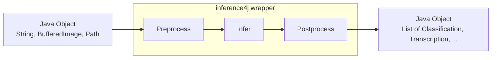
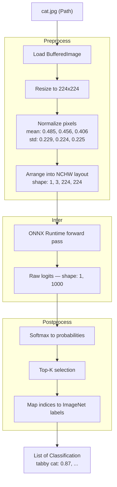

# How It Works

## What is ONNX?

[ONNX](https://onnx.ai/) (Open Neural Network Exchange) is an open standard for representing machine learning models. A model trained in any framework — PyTorch, TensorFlow, JAX — can be exported to a single `.onnx` file that captures the model's architecture and weights in a framework-independent format.

[ONNX Runtime](https://onnxruntime.ai/) is a high-performance engine that runs these `.onnx` files. It provides hardware acceleration (CPU, GPU, CoreML, CUDA) and has native bindings for many languages, including Java.

inference4j builds on top of the [ONNX Runtime Java API](https://onnxruntime.ai/docs/get-started/with-java.html), adding preprocessing, postprocessing, and model management so you don't have to work with tensors directly.

**Useful links:**

- [ONNX specification](https://onnx.ai/onnx/intro/)
- [ONNX Runtime documentation](https://onnxruntime.ai/docs/)
- [ONNX Runtime Java API](https://onnxruntime.ai/docs/get-started/with-java.html)
- [HuggingFace ONNX models](https://huggingface.co/models?library=onnx)

## The three-stage pipeline

Almost every inference task follows the same pattern:



### 1. Preprocess

Converts Java objects into **tensors** — the multi-dimensional arrays that models consume.

What this looks like depends on the domain:

| Domain | Input | Preprocessing |
|--------|-------|---------------|
| NLP | `String` | Tokenize text → `input_ids` + `attention_mask` tensors |
| Vision | `BufferedImage` | Resize, normalize pixels, rearrange channels → float tensor |
| Audio | `Path` (WAV file) | Load samples, resample to 16kHz, normalize → float tensor |

This is where most of the model-specific knowledge lives: normalization constants, tokenizer vocabulary, expected input dimensions, channel layout (NCHW vs NHWC).

### 2. Infer

A single forward pass through the ONNX model via ONNX Runtime. Tensors in, tensors out. This stage is model-agnostic — ONNX Runtime handles it regardless of which framework trained the model.

### 3. Postprocess

Converts raw output tensors back into meaningful Java objects.

| Task | Raw output | Postprocessing | Result |
|------|-----------|----------------|--------|
| Classification | Float array (logits) | Softmax → top-K → label mapping | `List<Classification>` |
| Object detection | Float array (boxes + scores) | NMS → coordinate rescaling → label mapping | `List<Detection>` |
| Speech-to-text | Float array (per-frame logits) | CTC greedy decode → character joining | `Transcription` |
| Text detection | Pixel-level heatmap | Thresholding → connected components → bounding boxes | `List<TextRegion>` |

## What is a Tensor?

A tensor is a multi-dimensional array of numbers. If you're familiar with Java arrays:

- A `float` is a 0-dimensional tensor (a scalar)
- A `float[]` is a 1-dimensional tensor (a vector)
- A `float[][]` is a 2-dimensional tensor (a matrix)
- A `float[][][]` is a 3-dimensional tensor

ML models consume and produce tensors with specific **shapes**. For example, a ResNet image classification model expects an input tensor with shape `[1, 3, 224, 224]` — that's 1 image, 3 color channels (RGB), 224 pixels tall, 224 pixels wide. The shape convention (`[batch, channels, height, width]` vs `[batch, height, width, channels]`) depends on the model's origin framework.

inference4j handles all tensor creation and interpretation internally. You never need to construct a tensor yourself.

## Example: what happens when you classify an image

```java
try (var classifier = ResNetClassifier.builder().build()) {
    List<Classification> results = classifier.classify(Path.of("cat.jpg"));
}
```

Behind that single `classify()` call:



All of this — the resizing, normalization, channel layout, softmax, label mapping — is encoded in the `ResNetClassifier` wrapper. A different model (say, EfficientNet) has different normalization constants, a different input layout (NHWC instead of NCHW), and may or may not need softmax applied. Each wrapper knows its model's requirements.

## Next steps

- [Browse use cases](../use-cases/sentiment-analysis.md) to see the wrappers in action
- [Adding a Wrapper](../contributing/adding-a-wrapper.md) explains the internals for contributors
