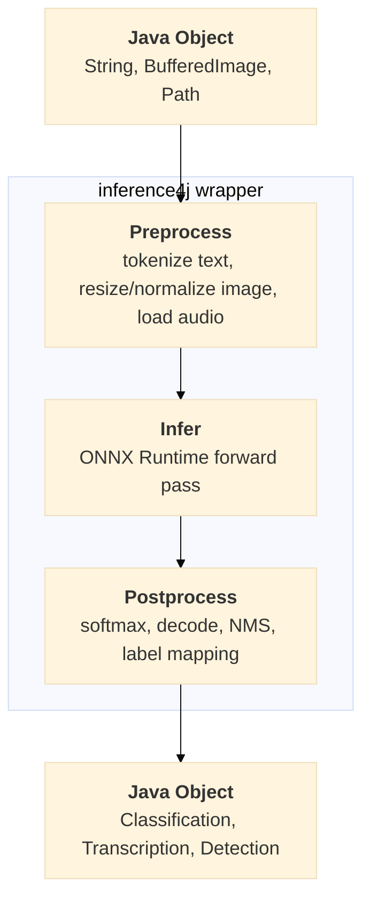

# inference4j

**Run AI models in Java. Three lines of code, zero setup.**

inference4j is an inference-only AI library for Java built on ONNX Runtime. It provides ergonomic, type-safe APIs for running model inference **locally** — no API keys, no network calls, no third-party services. Pass a `String`, `BufferedImage`, or `Path`, get Java objects back.

## What can you do with inference4j?

### Sentiment Analysis

```java
try (var classifier = DistilBertTextClassifier.builder().build()) {
    System.out.println(classifier.classify("This movie was fantastic!"));
    // [TextClassification[label=POSITIVE, confidence=0.9998]]
}
```

### Text Embeddings & Semantic Search

```java
try (var embedder = SentenceTransformerEmbedder.builder()
        .modelId("inference4j/all-MiniLM-L6-v2").build()) {
    float[] embedding = embedder.encode("Hello, world!");
}
```

### Image Classification

```java
try (var classifier = ResNetClassifier.builder().build()) {
    List<Classification> results = classifier.classify(Path.of("cat.jpg"));
    // [Classification[label=tabby cat, confidence=0.87], ...]
}
```

### Object Detection

```java
try (var detector = YoloV8Detector.builder().build()) {
    List<Detection> detections = detector.detect(Path.of("street.jpg"));
    // [Detection[label=car, confidence=0.94, box=BoundingBox[...]], ...]
}
```

### Speech-to-Text

```java
try (var recognizer = Wav2Vec2Recognizer.builder().build()) {
    System.out.println(recognizer.transcribe(Path.of("audio.wav")).text());
}
```

### Voice Activity Detection

```java
try (var vad = SileroVadDetector.builder().build()) {
    List<VoiceSegment> segments = vad.detect(Path.of("meeting.wav"));
    // [VoiceSegment[start=0.50, end=3.20], VoiceSegment[start=5.10, end=8.75]]
}
```

### Text Detection

```java
try (var detector = CraftTextDetector.builder().build()) {
    List<TextRegion> regions = detector.detect(Path.of("document.jpg"));
}
```

### Zero-Shot Image Classification

```java
try (var classifier = ClipClassifier.builder()
        .labels("cat", "dog", "bird", "car")
        .build()) {
    List<Classification> results = classifier.classify(Path.of("photo.jpg"));
    // [Classification[label=cat, confidence=0.82], ...]
}
```

### Search Reranking

```java
try (var reranker = MiniLMSearchReranker.builder().build()) {
    float score = reranker.score("What is Java?", "Java is a programming language.");
}
```

## What you don't have to do

- **No tokenization** — WordPiece tokenizers are built in and handled automatically
- **No tensor handling** — pass a `String`, `BufferedImage`, or `Path`; get Java objects back
- **No ONNX session setup** — `builder().build()` handles everything
- **No model downloads** — auto-downloaded from HuggingFace and cached on first use
- **No Python sidecar** — pure Java, runs anywhere Java runs

## Why inference4j?

### The problem

Running a trained ML model in Java sounds simple — load the model, pass some data, get a result. In practice, the inference call itself is the easy part. The hard part is everything around it: **preprocessing** and **postprocessing**.

Before a model can process an image, someone has to resize it, normalize the pixel values, rearrange the channels into the right layout (NCHW? NHWC?), and pack the result into a multi-dimensional float array called a **tensor**. After the model runs, someone has to interpret the raw output tensor — apply softmax to get probabilities, decode token IDs back into text, map class indices to human-readable labels, run non-maximum suppression to filter overlapping bounding boxes.

This work requires understanding the model's internals: its expected input shape, normalization constants, output format, and decoding strategy. ML engineers deal with this routinely. Java developers who need to ship a model to production shouldn't have to.

### Built on ONNX

inference4j embraces [ONNX](https://onnx.ai/) (Open Neural Network Exchange) as its runtime platform. ONNX is an open standard for representing ML models — a model trained in PyTorch, TensorFlow, or JAX can be exported to a single `.onnx` file and run anywhere via [ONNX Runtime](https://onnxruntime.ai/). This means inference4j can run models from any training framework without depending on that framework at runtime. No Python, no TensorFlow, no PyTorch — just a `.onnx` file and the ONNX Runtime native library.

### What inference4j does

The vast majority of inference tasks follow the same three-stage pattern: **preprocess → infer → postprocess**. inference4j provides curated wrappers that handle all three stages, so you work with standard Java types instead of tensors:



Each wrapper encapsulates the model-specific knowledge — the normalization constants, the tokenizer, the output decoding — so you don't have to.

### Where it fits

Java has great tools for building AI-powered applications. [Spring AI](https://spring.io/projects/spring-ai) provides an excellent abstraction layer for LLM orchestration. [DJL](https://djl.ai/) offers engine-agnostic model training and inference. [LangChain4j](https://docs.langchain4j.dev/) simplifies LLM-powered workflows.

**inference4j doesn't compete with any of them.** It fills a different gap: taking a specific ONNX model and making it trivial to call from Java, with all the preprocessing and postprocessing handled for you.

- **3-line integration** for popular models — `builder().build()`, call a method, get Java objects back
- **Standard Java types** in, standard Java types out — no tensor abstractions leak into your code
- **Inference only** — optimized for production serving, not training
- **Lightweight** — each wrapper is a thin layer over ONNX Runtime, not a framework
- **Complements the ecosystem** — use inference4j to run your embedding model, Spring AI to orchestrate your LLM chain, both in the same application

Learn more about the pipeline architecture in [How It Works](getting-started/how-it-works.md).

[Get started](getting-started/installation.md){ .md-button .md-button--primary }
[Browse use cases](use-cases/sentiment-analysis.md){ .md-button }
