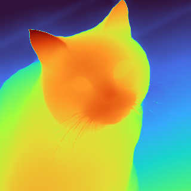

# Depth Estimation

Predict how far every pixel is from the camera using a single ordinary photograph — no stereo pair, no depth sensor. Useful for background blur, occlusion-aware compositing, 3D effects, and scene understanding.

## Quick example

```java
try (var estimator = DepthAnythingEstimator.builder().build()) {
    DepthMap depth = estimator.estimate(Path.of("room.jpg"));
}
```

## Full example

```java
import io.github.inference4j.vision.Colormap;
import io.github.inference4j.vision.DepthAnythingEstimator;
import io.github.inference4j.vision.DepthMap;
import io.github.inference4j.vision.ImageAnnotator;
import java.nio.file.Path;

public class DepthEstimation {
    public static void main(String[] args) throws Exception {
        try (var estimator = DepthAnythingEstimator.builder().build()) {
            DepthMap depth = estimator.estimate(Path.of("cat.jpg"));

            System.out.printf("Size: %d x %d%n", depth.width(), depth.height());
            System.out.printf("Range: %.3f to %.3f%n", depth.min(), depth.max());

            // Larger values are closer to the camera
            System.out.printf("Centre depth: %.3f%n",
                depth.at(depth.width() / 2, depth.height() / 2));

            ImageAnnotator.save(depth.toImage(Colormap.TURBO), Path.of("depth.png"));
        }
    }
}
```

<figure markdown="span">
  
  <figcaption>Depth Anything V2 Small output, rendered with <code>Colormap.TURBO</code> — warm is near, blue is far</figcaption>
</figure>

## Reading the values

Depth is **relative inverse depth**, not metres:

- **Larger values are closer** to the camera
- The scale is **model-dependent and differs between images**, so compare values within one map, never across two
- There is no absolute unit — this is ordering, not measurement

If you need metric depth in real-world units, this is not the right model.

## Rendering

A depth map is hard to read as raw numbers. `DepthMap` renders directly to an image, rescaled to its own range:

```java
BufferedImage gray  = depth.toImage();                   // grayscale
BufferedImage turbo = depth.toImage(Colormap.TURBO);     // high-contrast
BufferedImage vir   = depth.toImage(Colormap.VIRIDIS);   // colour-blind friendly
```

| Colormap | When to use |
|----------|-------------|
| `GRAYSCALE` | The image is data rather than a picture — feeding another process, thresholding |
| `TURBO` | Maximum contrast between near and far. Best default for looking at depth |
| `VIRIDIS` | Perceptually uniform and colour-blind friendly. Best for anything published |

## Builder options

| Method | Type | Default | Description |
|--------|------|---------|-------------|
| `.modelId(String)` | `String` | `inference4j/depth-anything-v2-small` | HuggingFace model ID |
| `.modelSource(ModelSource)` | `ModelSource` | `HuggingFaceModelSource` | Model resolution strategy |
| `.sessionOptions(SessionConfigurer)` | `SessionConfigurer` | default | ONNX Runtime session config |
| `.inputName(String)` | `String` | auto-detected | Input tensor name |
| `.targetSize(int)` | `int` | `518` | Long-side resize target, rounded up to a multiple of 14 |

## Result type

`DepthMap` is a record with:

| Field | Type | Description |
|-------|------|-------------|
| `values()` | `float[][]` | Per-pixel depth as `[height][width]` |
| `width()` | `int` | Map width, always matching the input image |
| `height()` | `int` | Map height, always matching the input image |

Plus `at(x, y)`, `min()`, `max()`, `toImage()` and `toImage(Colormap)`.

## How Depth Anything V2 works

A ViT backbone with a DPT decoder head, trained on a large mix of labelled and pseudo-labelled images. It predicts a dense depth value per patch, which the decoder upsamples to a full-resolution map.

The image is resized so its longer edge reaches `targetSize` with aspect ratio preserved, then both dimensions are rounded up to a multiple of **14** — the ViT patch size. Depth is predicted at that working resolution and bilinearly resampled back, so `DepthMap` coordinates always match the image you passed in.

## Available models

| Model | Parameters | Notes |
|-------|-----------|-------|
| `inference4j/depth-anything-v2-small` | ~25M | Default, and the only variant currently hosted |

Depth Anything V2 also ships Base (~98M) and Large (~335M) variants. They share the same
graph and the same input and output contract, so they work through this wrapper without
code changes — but they are not hosted under the `inference4j` org yet. To use one, point
`.modelId(...)` at another source and supply a `model.onnx` at the repository root:

```java
try (var estimator = DepthAnythingEstimator.builder()
        .modelSource(new LocalModelSource(Path.of("/models")))
        .modelId("depth-anything-v2-base")
        .build()) {
    DepthMap depth = estimator.estimate(image);
}
```

## Hardware acceleration

```java
try (var estimator = DepthAnythingEstimator.builder()
        .sessionOptions(opts -> opts.addCoreML())
        .build()) {
    estimator.estimate(Path.of("room.jpg"));
}
```

## Tips

- Both `Path` and `BufferedImage` inputs are supported.
- Raising `targetSize` recovers finer detail at roughly quadratic cost. Lower it for faster throughput on large batches.
- The output always matches your input dimensions, so a `DepthMap` can be indexed with the same coordinates as the source image.
- To composite by depth, threshold on a value read from the map itself — a fixed constant will not transfer between images, because the scale is per-image.
