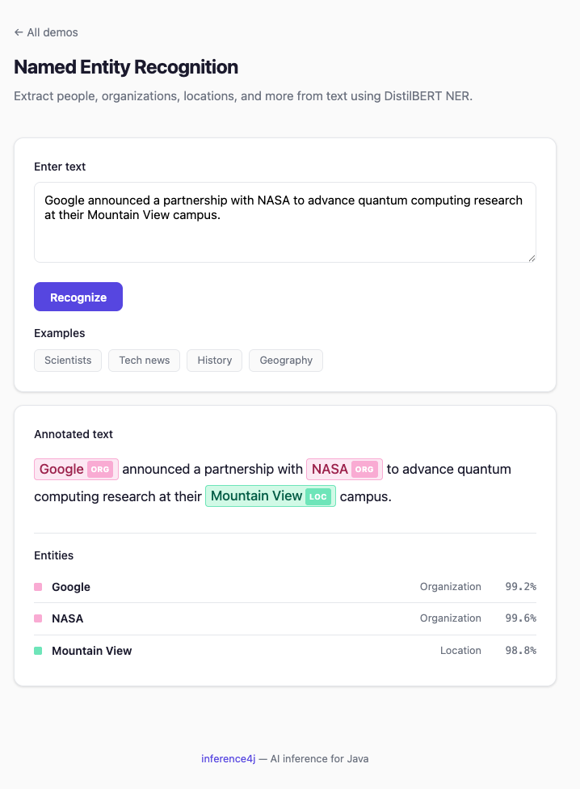

# Named Entity Recognition

Extract named entities (persons, organizations, locations, miscellaneous) from text using a fine-tuned BERT model.

## Quick example

```java
try (var ner = BertNerRecognizer.builder().build()) {
    List<NamedEntity> entities = ner.recognize("John works at Google in London.");
    // [NamedEntity[text=John, label=PER], NamedEntity[text=Google, label=ORG],
    //  NamedEntity[text=London, label=LOC]]
}
```

## Full example

```java
import io.github.inference4j.nlp.BertNerRecognizer;
import io.github.inference4j.nlp.NamedEntity;
import java.util.List;

public class NerExample {
    public static void main(String[] args) {
        try (var ner = BertNerRecognizer.builder().build()) {
            String text = "Marie Curie worked at the University of Paris in France.";
            List<NamedEntity> entities = ner.recognize(text);

            for (NamedEntity entity : entities) {
                System.out.printf("%-20s → %s (%.2f%%)%n",
                    entity.text(), entity.label(), entity.score() * 100);
            }
            // Marie Curie          → PER (99.12%)
            // University of Paris  → ORG (98.45%)
            // France               → LOC (97.89%)
        }
    }
}
```

<figure markdown="span">
  
  <figcaption>Screenshot from showcase app</figcaption>
</figure>

## Builder options

| Method | Type | Default | Description |
|--------|------|---------|-------------|
| `.modelId(String)` | `String` | `inference4j/distilbert-NER` | HuggingFace model ID |
| `.modelSource(ModelSource)` | `ModelSource` | `HuggingFaceModelSource` | Model resolution strategy |
| `.sessionOptions(SessionConfigurer)` | `SessionConfigurer` | default | ONNX Runtime session config |
| `.tokenizer(Tokenizer)` | `Tokenizer` | auto-loaded `WordPieceTokenizer` (cased) | Custom tokenizer |
| `.config(ModelConfig)` | `ModelConfig` | auto-loaded from `config.json` | Model config with IOB2 labels |
| `.maxLength(int)` | `int` | `512` | Maximum token sequence length |
| `.truncation(TruncationPolicy)` | `TruncationPolicy` | `TRUNCATE` | Input longer than the token limit: `TRUNCATE` keeps the first tokens and logs a warning, `FAIL` throws `InputTooLongException`. See [Input length](../reference/configuration.md#input-length) |
| `.stride(int)` | `int` | off | Process input longer than `maxLength` in full, as overlapping windows sharing this many tokens. When set, input is never truncated |

## Input length

| Limit | When exceeded | Long-input strategies |
|-------|---------------|-----------------------|
| `maxLength` tokens (512 by default), including `[CLS]` and `[SEP]` | Truncated with a warning (default), or rejected with `.truncation(TruncationPolicy.FAIL)` | `.stride(int)`: overlapping windows, whole input processed |

Without `stride`, entities after the limit are not found.

### Long documents

Set `stride` to process the whole document. The text is split into overlapping windows of `maxLength` tokens, and each token keeps the label from the window where it sits most centrally. Character offsets always refer to the original text:

```java
try (var ner = BertNerRecognizer.builder()
        .maxLength(256)
        .stride(64)
        .build()) {
    List<NamedEntity> entities = ner.recognize(longDocument);   // entities from the whole document
}
```

#### Choosing the window size

The default `distilbert-NER` model was trained on single sentences and loses accuracy on long inputs, so smaller windows find more entities. These are results on the 31 long articles (over 512 tokens) of the [CoNLL-2003](https://www.clips.uantwerpen.be/conll2003/ner/) test set, the benchmark this model was trained and evaluated on. Scores are entity-level: an entity counts only if its exact span and type match the human annotation.

| Configuration | F1 | Recall | Precision |
|---|---|---|---|
| No windowing (truncates at 512 tokens) | 0.566 | 0.522 | 0.619 |
| `stride(128)` with the default `maxLength(512)` | 0.682 | 0.699 | 0.665 |
| **`maxLength(256).stride(64)`** | **0.766** | 0.774 | 0.758 |
| `maxLength(128).stride(32)` | 0.773 | 0.782 | 0.763 |
| One sentence at a time, split automatically with the JDK's `BreakIterator` | 0.753 | 0.757 | 0.749 |
| One sentence at a time, using the dataset's human-marked sentences (reference) | 0.830 | 0.875 | 0.790 |

- **Use `maxLength(256).stride(64)`.** It recovers most of the accuracy lost to long inputs. Smaller windows add model calls for little further gain.
- **Without windowing, about half of the entities in a long article are missed** (recall 0.522), because everything past 512 tokens is ignored.
- **Splitting into sentences automatically does not beat windows.** With the JDK's rule-based `BreakIterator`, sentence-by-sentence recognition scores slightly below 256-token windows. Only perfect, human-marked sentence boundaries do better (the reference row), because news text has headlines, datelines and tables that rule-based splitters merge into run-on sentences.

The evaluation is reproducible locally; see `BertNerLongDocumentEvaluation` in the model tests.

## Result type

`NamedEntity` is a record with:

| Field | Type | Description |
|-------|------|-------------|
| `text()` | `String` | The entity span text (e.g., "London") |
| `label()` | `String` | Entity type: `PER`, `ORG`, `LOC`, or `MISC` |
| `start()` | `int` | Character offset start in the original string |
| `end()` | `int` | Character offset end (exclusive) in the original string |
| `score()` | `float` | Mean confidence of the constituent tokens (0.0 to 1.0) |

## Entity types

The default model uses CoNLL-2003 IOB2 labels:

| Label | Description | Examples |
|-------|-------------|----------|
| `PER` | Person | John, Marie Curie, Leonardo da Vinci |
| `ORG` | Organization | Google, United Nations, NASA |
| `LOC` | Location | London, New York, Pacific Ocean |
| `MISC` | Miscellaneous | English, FIFA World Cup, Nobel Prize |

## Available models

| Model | Wrapper | Size | F1 | License |
|-------|---------|------|-----|---------|
| `inference4j/distilbert-NER` | `BertNerRecognizer` | ~260 MB | 92.17 | Apache 2.0 |
| `inference4j/bert-base-NER` | `BertNerRecognizer` | ~431 MB | 91.3 | MIT |

```java
// Use the larger BERT model for slightly different accuracy characteristics
try (var ner = BertNerRecognizer.builder()
        .modelId("inference4j/bert-base-NER")
        .build()) {
    ner.recognize("...");
}
```

## How it works

1. Text is tokenized using a **cased** WordPiece tokenizer (case matters for NER: "Apple" vs "apple")
2. Subword tokens that belong to the same word share a word ID
3. The model predicts an IOB2 label for each token
4. First-subtoken strategy: only the first subtoken's prediction is used for each word
5. `B-*` and `I-*` spans are aggregated into `NamedEntity` objects with character offsets

## Tips

- The default model is **cased** — "Apple" (ORG) and "apple" (fruit) are different tokens. Do not lowercase your input.
- Multi-word entities like "New York" are automatically grouped when the model predicts `B-LOC` followed by `I-LOC`.
- Character offsets (`start()`, `end()`) can be used to highlight entities in the original text.
- For production use, consider the distilbert variant — it's faster with minimal accuracy loss.
