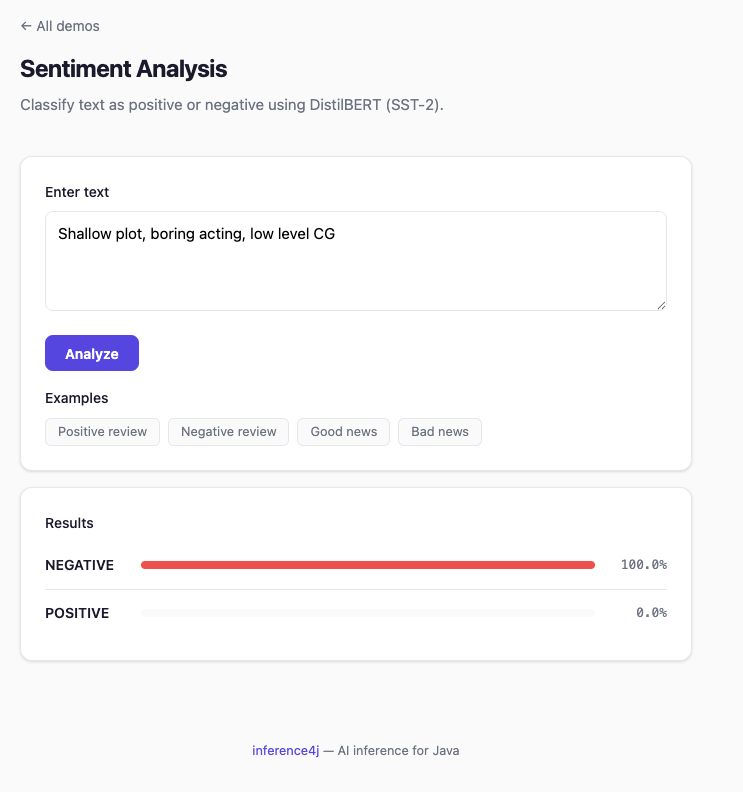

# Sentiment Analysis

Classify text as positive or negative (or any custom label set) using a fine-tuned DistilBERT model.

## Quick example

```java
try (var classifier = DistilBertTextClassifier.builder().build()) {
    List<TextClassification> results = classifier.classify("This movie was fantastic!");
    // [TextClassification[label=POSITIVE, confidence=0.9998]]
}
```

## Full example

```java
import io.github.inference4j.nlp.DistilBertTextClassifier;
import io.github.inference4j.nlp.TextClassification;
import java.util.List;

public class SentimentAnalysis {
    public static void main(String[] args) {
        try (var classifier = DistilBertTextClassifier.builder().build()) {
            List<String> reviews = List.of(
                "This movie was fantastic!",
                "Terrible experience, would not recommend.",
                "It was okay, nothing special."
            );

            for (String review : reviews) {
                List<TextClassification> results = classifier.classify(review);
                TextClassification top = results.get(0);
                System.out.printf("%-45s → %s (%.2f%%)%n",
                    review, top.label(), top.confidence() * 100);
            }
        }
    }
}
```

<figure markdown="span">
  
  <figcaption>Screenshot from showcase app</figcaption>
</figure>

## Builder options

| Method | Type | Default | Description |
|--------|------|---------|-------------|
| `.modelId(String)` | `String` | `inference4j/distilbert-base-uncased-finetuned-sst-2-english` | HuggingFace model ID |
| `.modelSource(ModelSource)` | `ModelSource` | `HuggingFaceModelSource` | Model resolution strategy |
| `.sessionOptions(SessionConfigurer)` | `SessionConfigurer` | default | ONNX Runtime session config |
| `.tokenizer(Tokenizer)` | `Tokenizer` | auto-loaded `WordPieceTokenizer` | Custom tokenizer |
| `.config(ModelConfig)` | `ModelConfig` | auto-loaded from `config.json` | Model config with labels |
| `.outputOperator(OutputOperator)` | `OutputOperator` | auto-detected (softmax or sigmoid) | Output activation |
| `.maxLength(int)` | `int` | `512` | Maximum token sequence length |

## Result type

`TextClassification` is a record with:

| Field | Type | Description |
|-------|------|-------------|
| `label()` | `String` | Classification label (e.g., `POSITIVE`) |
| `classIndex()` | `int` | Numeric class index |
| `confidence()` | `float` | Confidence score (0.0 to 1.0) |

## Using custom models

Any HuggingFace text classification model exported to ONNX will work, as long as it includes `vocab.txt` and `config.json` with `id2label` mappings.

```java
try (var classifier = DistilBertTextClassifier.builder()
        .modelId("your-org/your-model")
        .build()) {
    classifier.classify("Some text");
}
```

The output activation (softmax vs sigmoid) is auto-detected from `config.json`:

- `problem_type: "multi_label_classification"` → sigmoid
- Everything else → softmax

## Tips

- The default model is fine-tuned on SST-2 (movie reviews). For other domains (product reviews, support tickets), use a model fine-tuned on relevant data.
- Use `.classify(text, topK)` to limit the number of returned classifications.
- For multi-label classification (where multiple labels can be true simultaneously), use a model with `problem_type: "multi_label_classification"` in its `config.json`.
