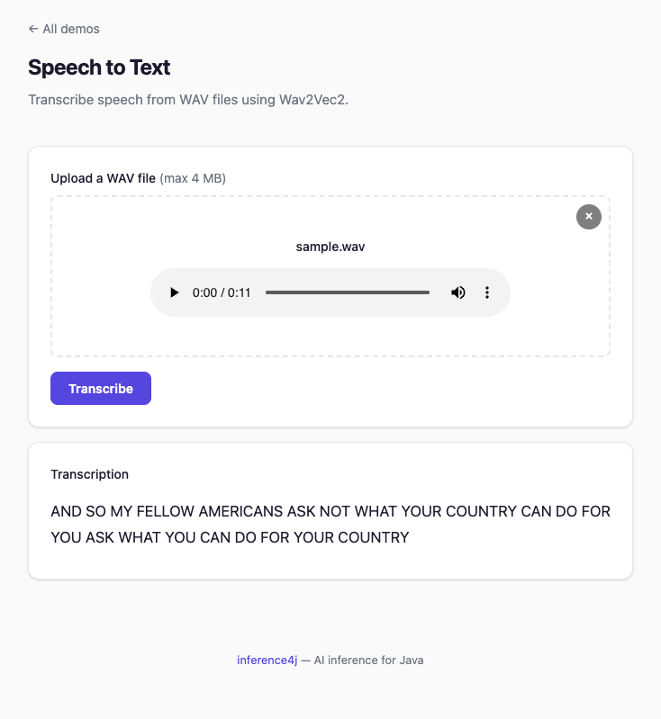

# Speech-to-Text

Transcribe audio files using Wav2Vec2, a non-autoregressive CTC model that converts speech to text in a single forward pass.

## Quick example

```java
try (var recognizer = Wav2Vec2Recognizer.builder().build()) {
    System.out.println(recognizer.transcribe(Path.of("audio.wav")).text());
}
```

## Full example

```java
import io.github.inference4j.audio.Wav2Vec2Recognizer;
import io.github.inference4j.audio.Transcription;
import java.nio.file.Path;

public class SpeechToText {
    public static void main(String[] args) {
        try (var recognizer = Wav2Vec2Recognizer.builder().build()) {
            Transcription result = recognizer.transcribe(Path.of("speech.wav"));
            System.out.println(result.text());
        }
    }
}
```

<figure markdown="span">
  
  <figcaption>Screenshot from showcase app</figcaption>
</figure>

## From raw audio data

If you already have audio samples as a float array:

```java
try (var recognizer = Wav2Vec2Recognizer.builder().build()) {
    float[] audioData = loadAudioSamples(); // your audio loading logic
    Transcription result = recognizer.transcribe(audioData, 16000);
    System.out.println(result.text());
}
```

## Builder options

| Method | Type | Default | Description |
|--------|------|---------|-------------|
| `.modelId(String)` | `String` | `inference4j/wav2vec2-base-960h` | HuggingFace model ID |
| `.modelSource(ModelSource)` | `ModelSource` | `HuggingFaceModelSource` | Model resolution strategy |
| `.sessionOptions(SessionConfigurer)` | `SessionConfigurer` | default | ONNX Runtime session config |
| `.vocabulary(Vocabulary)` | `Vocabulary` | auto-loaded from `vocab.json` | CTC vocabulary |
| `.inputName(String)` | `String` | auto-detected | Input tensor name |
| `.sampleRate(int)` | `int` | `16000` | Target sample rate (Hz) |
| `.blankIndex(int)` | `int` | `0` | CTC blank token index |
| `.wordDelimiter(String)` | `String` | `"\|"` | Word separator token in vocabulary |

## Result type

`Transcription` is a record with:

| Field | Type | Description |
|-------|------|-------------|
| `text()` | `String` | The transcribed text |

## Audio requirements

- **Format**: WAV files (loaded automatically from `Path`)
- **Sample rate**: Audio is automatically resampled to the model's target rate (16kHz by default)
- **Channels**: Mono (stereo is downmixed automatically)
- **Duration**: No hard limit, but very long files will use more memory

## How it works

Wav2Vec2 is a **non-autoregressive** model — it processes the entire audio waveform in a single forward pass and produces character-level predictions using CTC (Connectionist Temporal Classification) decoding.

The pipeline:

1. Load and normalize audio from WAV file
2. Resample to 16kHz if needed
3. Run a single forward pass through the model
4. Apply CTC greedy decoding to convert logits to characters
5. Join characters into words using the word delimiter

## Tips

- The default model (`wav2vec2-base-960h`) is trained on English LibriSpeech data. For other languages, use an appropriate fine-tuned model.
- Wav2Vec2 works best with clean speech. For noisy audio, consider preprocessing with VAD to extract speech segments first — see [Voice Activity Detection](voice-activity-detection.md).
- This is a CTC model (single-pass), not an autoregressive model like Whisper. It's fast but may be less accurate on complex audio.
