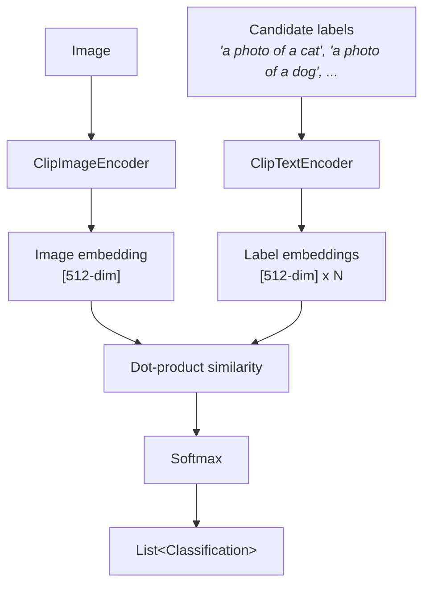

# Visual Search

Classify images using arbitrary text labels — no training required — powered by [CLIP](https://arxiv.org/abs/2103.00020).

## Quick start

```java
try (ClipClassifier classifier = ClipClassifier.builder().build()) {
    List<Classification> results = classifier.classify(
            Path.of("photo.jpg"), List.of("cat", "dog", "bird", "car", "airplane"));
    System.out.println(results.get(0).label());      // "cat"
    System.out.println(results.get(0).confidence());  // 0.92
}
```

## Zero-shot classification

Unlike traditional image classifiers that are trained on a fixed set of labels, CLIP classifies images against **any labels you provide at each call**. Just pass the labels you need — no retraining, no fine-tuning, and no need to rebuild the classifier for different label sets:

```java
try (ClipClassifier classifier = ClipClassifier.builder().build()) {
    // Emotion detection
    classifier.classify(image, List.of(
            "a photo of a happy person", "a photo of a sad person",
            "a photo of an angry person", "a photo of a surprised person"));

    // Product categorization
    classifier.classify(image, List.of(
            "a product photo of electronics", "a product photo of clothing",
            "a product photo of furniture", "a product photo of food"));

    // Scene classification
    classifier.classify(image, List.of(
            "a landscape photo of a beach", "a landscape photo of a mountain",
            "a landscape photo of a city", "a landscape photo of a forest"));
}
```

## How it works

CLIP uses two separate encoders — one for images, one for text — trained so that matching image-text pairs produce similar embeddings. `ClipClassifier` wraps both encoders:



## Builder options

| Option | Type | Default | Description |
|--------|------|---------|-------------|
| `modelId(String)` | `String` | `inference4j/clip-vit-base-patch32` | HuggingFace model ID |
| `modelSource(ModelSource)` | `ModelSource` | `HuggingFaceModelSource` | Where to load the model from |
| `sessionOptions(SessionConfigurer)` | `SessionConfigurer` | Default (CPU) | ONNX Runtime session options |

## Prompt tips

CLIP was trained on natural language captions, so passing full prompt text as labels produces better results than bare nouns. The label text is passed directly to the text encoder — format it however works best for your use case:

| Use case | Label examples | Why |
|----------|----------------|-----|
| General objects | `"a photo of a cat"`, `"a photo of a dog"` | Matches CLIP training data format |
| Fine-grained | `"a photo of a tabby cat, a type of pet"` | Adds context for disambiguation |
| Scenes | `"a beach landscape"`, `"a mountain landscape"` | Descriptive captions |
| Actions | `"a photo of a person running"` | Activity descriptions |
| Styles | `"an impressionist style painting"` | Art style descriptions |

## API methods

```java
// Primary API — classify with candidate labels
List<Classification> classify(BufferedImage image, List<String> candidateLabels);
List<Classification> classify(BufferedImage image, List<String> candidateLabels, int topK);

// Path convenience overloads
List<Classification> classify(Path imagePath, List<String> candidateLabels);
List<Classification> classify(Path imagePath, List<String> candidateLabels, int topK);

// InferenceTask compatibility
List<Classification> run(ZeroShotInput<BufferedImage> input);
```

## Advanced: direct encoder access

For use cases beyond classification — image search, image-text similarity, or custom pipelines — use `ClipImageEncoder` and `ClipTextEncoder` directly. See the [CLIP Encoders reference](../reference/clip-encoders.md).

## Alternative models

The default model is `inference4j/clip-vit-base-patch32` (ViT-B/32) — the smallest and fastest variant. You can use other CLIP-compatible models by exporting them to ONNX with the same input/output layout and pointing to them via `.modelId()` or `.modelSource()`.

Possible variants (not yet tested with inference4j):

| Model | Source | Embedding dim | Notes |
|-------|--------|---------------|-------|
| `openai/clip-vit-base-patch16` | OpenAI | 512 | 16×16 patches — better quality, ~2× slower |
| `openai/clip-vit-large-patch14` | OpenAI | 768 | Best quality from OpenAI, significantly larger |
| `laion/CLIP-ViT-B-32-laion2B-s34B-b79K` | OpenCLIP | 512 | Trained on LAION-2B, often outperforms OpenAI's original |
| `laion/CLIP-ViT-L-14-laion2B-s32B-b82K` | OpenCLIP | 768 | Large variant trained on LAION-2B |
| `google/siglip-base-patch16-224` | Google | 768 | SigLIP — improved training objective, strong zero-shot performance |

!!! note
    Models with different embedding dimensions (e.g., 768 instead of 512) will work — the wrappers don't assume a fixed size. However, you must use the same model for both image and text encoding since embeddings are only comparable within the same model's vector space.

## Model details

| Property | Value |
|----------|-------|
| Architecture | ViT-B/32 (vision) + Transformer (text) |
| Embedding dimensions | 512 |
| Image input | 224×224 RGB, CLIP-normalized |
| Text input | BPE tokenized, max 77 tokens |
| Default model | [`inference4j/clip-vit-base-patch32`](https://huggingface.co/inference4j/clip-vit-base-patch32) |
| Model size | ~340 MB (vision) + ~255 MB (text) |
