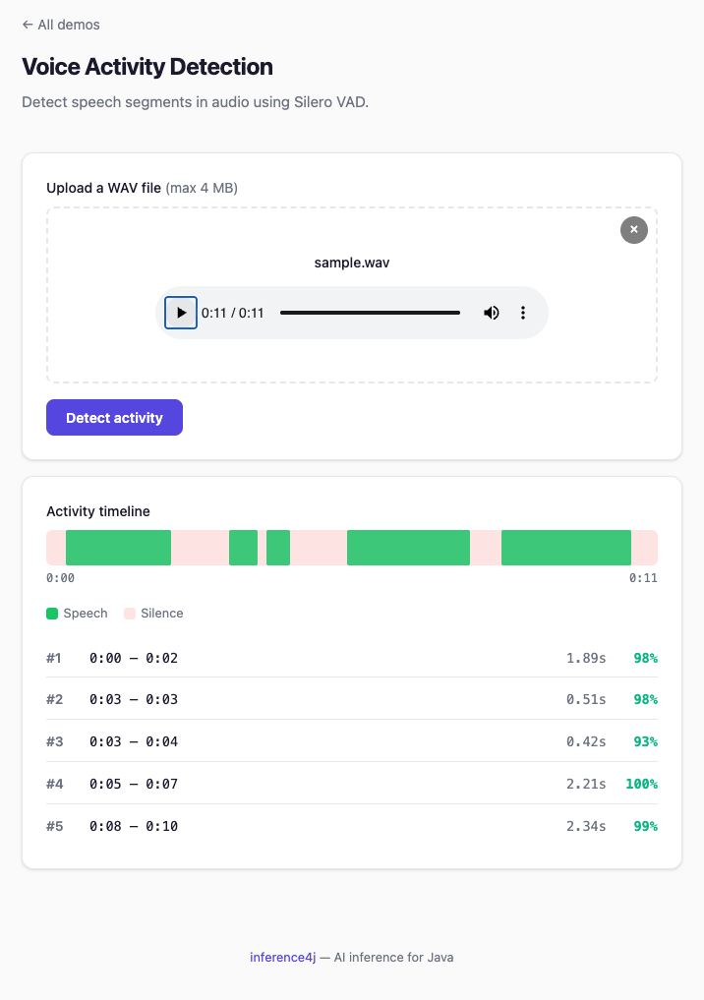

# Voice Activity Detection

Detect speech segments in audio using Silero VAD. Returns timestamped segments with confidence scores — useful for preprocessing audio before transcription, or for detecting when someone is speaking.

## Quick example

```java
try (var vad = SileroVadDetector.builder().build()) {
    List<VoiceSegment> segments = vad.detect(Path.of("meeting.wav"));
    // [VoiceSegment[start=0.50, end=3.20], VoiceSegment[start=5.10, end=8.75]]
}
```

## Full example

```java
import io.github.inference4j.audio.SileroVadDetector;
import io.github.inference4j.audio.VoiceSegment;
import java.nio.file.Path;

public class VoiceActivityDetection {
    public static void main(String[] args) {
        try (var vad = SileroVadDetector.builder()
                .threshold(0.7f)
                .minSpeechDuration(0.3f)
                .minSilenceDuration(0.15f)
                .build()) {

            List<VoiceSegment> segments = vad.detect(Path.of("meeting.wav"));

            for (VoiceSegment seg : segments) {
                System.out.printf("%.2fs - %.2fs (duration: %.2fs, confidence: %.2f)%n",
                    seg.start(), seg.end(), seg.duration(), seg.confidence());
            }
        }
    }
}
```

<figure markdown="span">
  
  <figcaption>Screenshot from showcase app</figcaption>
</figure>

## Per-frame probabilities

For visualization or custom segmentation logic, extract raw speech probabilities:

```java
try (var vad = SileroVadDetector.builder().build()) {
    float[] probabilities = vad.probabilities(Path.of("audio.wav"));
    // One probability per frame (32ms window at 16kHz)
}
```

## From raw audio data

```java
try (var vad = SileroVadDetector.builder().build()) {
    float[] audioData = loadAudioSamples();
    List<VoiceSegment> segments = vad.detect(audioData, 16000);
}
```

## Builder options

| Method | Type | Default | Description |
|--------|------|---------|-------------|
| `.modelId(String)` | `String` | `inference4j/silero-vad` | HuggingFace model ID |
| `.modelSource(ModelSource)` | `ModelSource` | `HuggingFaceModelSource` | Model resolution strategy |
| `.sessionOptions(SessionConfigurer)` | `SessionConfigurer` | default | ONNX Runtime session config |
| `.sampleRate(int)` | `int` | `16000` | Target sample rate (Hz) |
| `.windowSizeSamples(int)` | `int` | `512` | Frame window size (512 = 32ms at 16kHz) |
| `.threshold(float)` | `float` | `0.5` | Speech probability threshold |
| `.minSpeechDuration(float)` | `float` | `0.25` | Minimum speech segment duration (seconds) |
| `.minSilenceDuration(float)` | `float` | `0.1` | Minimum silence gap between segments (seconds) |
| `.speechPadding(float)` | `float` | `0` | Extends each segment by this many seconds on both sides, without overlapping neighbours |

## Result type

`VoiceSegment` is a record with:

| Field | Type | Description |
|-------|------|-------------|
| `start()` | `float` | Segment start time in seconds |
| `end()` | `float` | Segment end time in seconds |
| `duration()` | `float` | Segment duration in seconds |
| `confidence()` | `float` | Average speech probability for the segment |

## Tuning thresholds

The default thresholds work well for clean speech. Adjust for your use case:

| Scenario | `threshold` | `minSpeechDuration` | `minSilenceDuration` |
|----------|-------------|---------------------|----------------------|
| Clean speech (default) | `0.5` | `0.25` | `0.1` |
| Noisy environment | `0.7` | `0.3` | `0.15` |
| Short utterances (commands) | `0.5` | `0.1` | `0.05` |
| Long-form speech (podcasts) | `0.5` | `0.5` | `0.3` |

## Combining with speech-to-text

Use VAD to transcribe only the voiced parts of a recording. Silero's segment boundaries are tight, so audio cut exactly at a boundary can lose the first or last sound of a word. Add `speechPadding` when you transcribe segments:

```java
try (var vad = SileroVadDetector.builder()
             .speechPadding(0.2f)
             .minSilenceDuration(0.3f)
             .build();
     var recognizer = Wav2Vec2Recognizer.builder().build()) {

    AudioData audio = AudioLoader.load(Path.of("meeting.wav"));
    for (VoiceSegment segment : vad.detect(audio.samples(), audio.sampleRate())) {
        int from = Math.round(segment.start() * audio.sampleRate());
        int to = Math.min(audio.samples().length, Math.round(segment.end() * audio.sampleRate()));
        String text = recognizer.transcribe(
                Arrays.copyOfRange(audio.samples(), from, to), audio.sampleRate()).text();
        System.out.printf("[%.1fs-%.1fs] %s%n", segment.start(), segment.end(), text);
    }
}
```

- **`speechPadding(0.2f)`** keeps word edges inside each segment. On a short test recording, it halved the words that differed from transcribing the whole file at once (18% → 9%). Padding of 0.2–0.3 seconds worked best; at 0.5 seconds results got worse again.
- **`minSilenceDuration(0.3f)`** stops very short pauses between words from splitting a phrase into fragments that are too short to transcribe well.
- Padding never extends past the start or end of the audio, and neighbouring segments never overlap. When two segments are closer than twice the padding, they meet halfway.

## Tips

- Silero VAD is a **stateful model** — it maintains hidden state across frames for context. This is handled internally.
- The model supports both 16kHz and 8kHz sample rates.
- Use `probabilities()` to inspect per-frame speech likelihood for debugging or visualization.
- For real-time applications, the 32ms window size (512 samples at 16kHz) provides low-latency detection.
